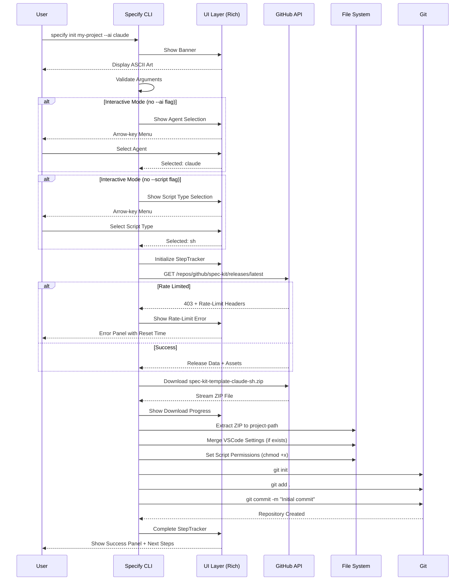
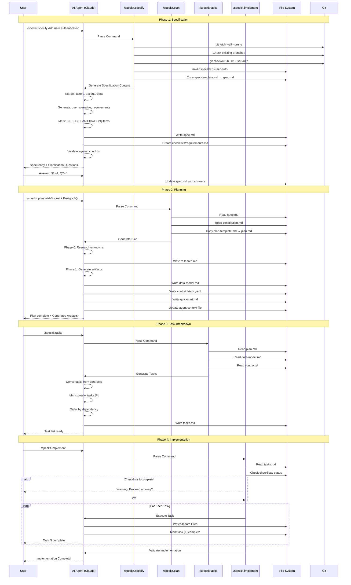
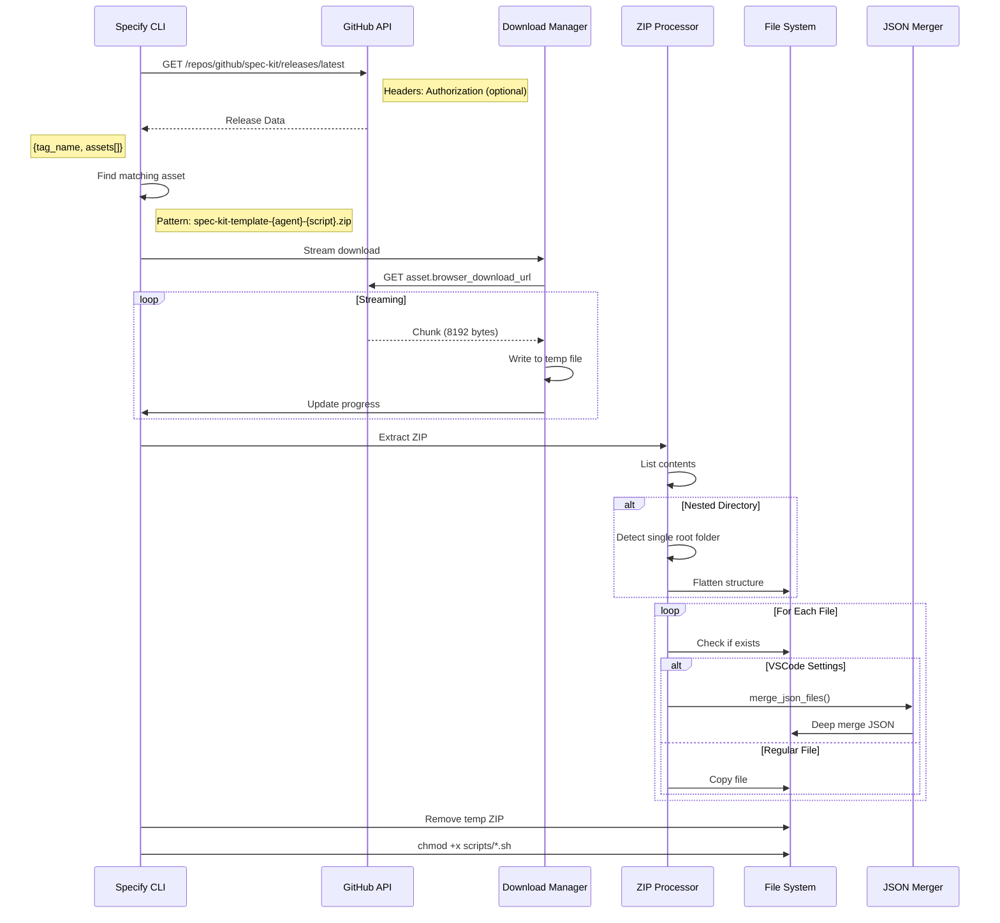
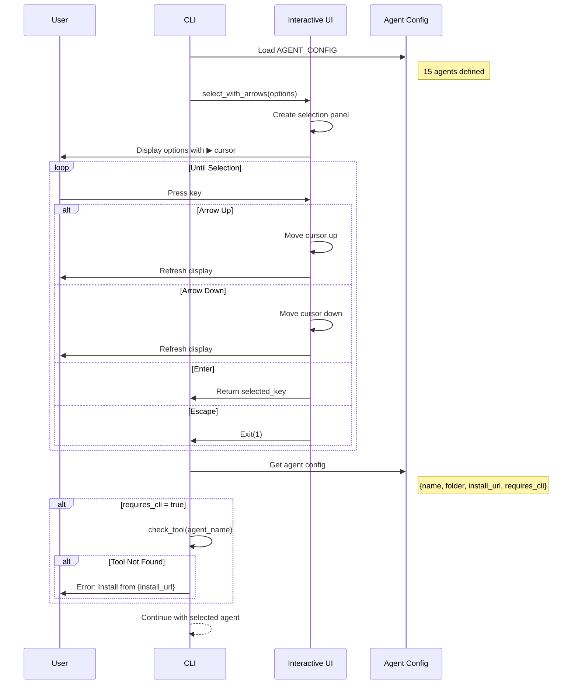

# Spec Kit - Kiến Trúc Hệ Thống & Sequence Diagrams

## 1. Tổng Quan Kiến Trúc

### 1.1 High-Level Architecture

```
┌─────────────────────────────────────────────────────────────────────────────┐
│                              SPEC KIT ECOSYSTEM                              │
├─────────────────────────────────────────────────────────────────────────────┤
│                                                                              │
│    ┌─────────────────────────────────────────────────────────────────┐      │
│    │                         USER LAYER                               │      │
│    │  ┌──────────┐  ┌──────────┐  ┌──────────┐  ┌──────────┐        │      │
│    │  │Developer │  │  PM/PO   │  │Tech Lead │  │    QA    │        │      │
│    │  └────┬─────┘  └────┬─────┘  └────┬─────┘  └────┬─────┘        │      │
│    └───────┼─────────────┼─────────────┼─────────────┼───────────────┘      │
│            │             │             │             │                       │
│            ▼             ▼             ▼             ▼                       │
│    ┌─────────────────────────────────────────────────────────────────┐      │
│    │                       CLI INTERFACE                              │      │
│    │                                                                  │      │
│    │   $ specify init my-project --ai claude --script sh             │      │
│    │   $ specify check                                                │      │
│    │   $ specify version                                              │      │
│    │                                                                  │      │
│    └──────────────────────────┬──────────────────────────────────────┘      │
│                               │                                              │
│                               ▼                                              │
│    ┌─────────────────────────────────────────────────────────────────┐      │
│    │                      CORE ENGINE                                 │      │
│    │  ┌────────────┐  ┌────────────┐  ┌────────────┐  ┌──────────┐  │      │
│    │  │  Template  │  │   GitHub   │  │    Git     │  │   File   │  │      │
│    │  │  Manager   │  │ API Client │  │  Manager   │  │  System  │  │      │
│    │  └────────────┘  └────────────┘  └────────────┘  └──────────┘  │      │
│    └──────────────────────────┬──────────────────────────────────────┘      │
│                               │                                              │
│                               ▼                                              │
│    ┌─────────────────────────────────────────────────────────────────┐      │
│    │                    AI AGENT LAYER                                │      │
│    │                                                                  │      │
│    │  ┌─────────┐ ┌─────────┐ ┌─────────┐ ┌─────────┐ ┌─────────┐   │      │
│    │  │ Claude  │ │ Copilot │ │ Gemini  │ │ Cursor  │ │  Qwen   │   │      │
│    │  │  Code   │ │         │ │   CLI   │ │         │ │  Code   │   │      │
│    │  └─────────┘ └─────────┘ └─────────┘ └─────────┘ └─────────┘   │      │
│    │  ┌─────────┐ ┌─────────┐ ┌─────────┐ ┌─────────┐ ┌─────────┐   │      │
│    │  │ Codex   │ │Windsurf │ │KiloCode │ │ Auggie  │ │AmazonQ  │   │      │
│    │  └─────────┘ └─────────┘ └─────────┘ └─────────┘ └─────────┘   │      │
│    └─────────────────────────────────────────────────────────────────┘      │
│                                                                              │
└─────────────────────────────────────────────────────────────────────────────┘
```

### 1.2 Component Architecture

```
┌─────────────────────────────────────────────────────────────────────────────┐
│                           SPECIFY CLI COMPONENTS                             │
├─────────────────────────────────────────────────────────────────────────────┤
│                                                                              │
│  ┌──────────────────────────────────────────────────────────────────────┐   │
│  │                         PRESENTATION LAYER                            │   │
│  │  ┌─────────────┐  ┌─────────────┐  ┌─────────────┐  ┌────────────┐  │   │
│  │  │   Banner    │  │   Console   │  │   Progress  │  │Interactive │  │   │
│  │  │  Renderer   │  │   Output    │  │   Tracker   │  │  Selector  │  │   │
│  │  │ (Rich/Text) │  │  (Rich)     │  │(StepTracker)│  │(Arrow Keys)│  │   │
│  │  └─────────────┘  └─────────────┘  └─────────────┘  └────────────┘  │   │
│  └──────────────────────────────────────────────────────────────────────┘   │
│                                      │                                       │
│                                      ▼                                       │
│  ┌──────────────────────────────────────────────────────────────────────┐   │
│  │                          BUSINESS LOGIC LAYER                         │   │
│  │  ┌─────────────┐  ┌─────────────┐  ┌─────────────┐  ┌────────────┐  │   │
│  │  │    Init     │  │    Check    │  │   Version   │  │   Config   │  │   │
│  │  │   Command   │  │   Command   │  │   Command   │  │  Manager   │  │   │
│  │  └─────────────┘  └─────────────┘  └─────────────┘  └────────────┘  │   │
│  │                                                                       │   │
│  │  ┌─────────────┐  ┌─────────────┐  ┌─────────────┐                   │   │
│  │  │  Template   │  │   Script    │  │  Validation │                   │   │
│  │  │  Processor  │  │  Executor   │  │   Engine    │                   │   │
│  │  └─────────────┘  └─────────────┘  └─────────────┘                   │   │
│  └──────────────────────────────────────────────────────────────────────┘   │
│                                      │                                       │
│                                      ▼                                       │
│  ┌──────────────────────────────────────────────────────────────────────┐   │
│  │                         INFRASTRUCTURE LAYER                          │   │
│  │  ┌─────────────┐  ┌─────────────┐  ┌─────────────┐  ┌────────────┐  │   │
│  │  │   GitHub    │  │     Git     │  │    File     │  │    SSL     │  │   │
│  │  │ API Client  │  │  Interface  │  │   System    │  │  Context   │  │   │
│  │  │   (httpx)   │  │(subprocess) │  │  (pathlib)  │  │(truststore)│  │   │
│  │  └─────────────┘  └─────────────┘  └─────────────┘  └────────────┘  │   │
│  └──────────────────────────────────────────────────────────────────────┘   │
│                                                                              │
└─────────────────────────────────────────────────────────────────────────────┘
```

---

## 2. Sequence Diagrams

### 2.1 CLI Init Command Flow



### 2.2 SDD Workflow - Full Feature Development



### 2.3 Template Download & Extraction



### 2.4 Agent Configuration Selection



---

## 3. Data Flow Diagrams

### 3.1 Feature Specification Data Flow

```
┌──────────────────────────────────────────────────────────────────────────┐
│                    FEATURE SPECIFICATION DATA FLOW                        │
├──────────────────────────────────────────────────────────────────────────┤
│                                                                           │
│  INPUT                    PROCESS                      OUTPUT             │
│  ═════                    ═══════                      ══════             │
│                                                                           │
│  ┌────────────┐          ┌────────────┐              ┌────────────┐      │
│  │   User     │          │  /speckit  │              │  spec.md   │      │
│  │Description │────────► │  .specify  │────────────► │            │      │
│  │            │          │            │              │ - Overview │      │
│  └────────────┘          └─────┬──────┘              │ - Scenarios│      │
│                                │                      │ - Reqs     │      │
│  ┌────────────┐                │                      │ - Success  │      │
│  │   spec-    │                │                      │   Criteria │      │
│  │  template  │────────────────┘                      └────────────┘      │
│  │   .md      │                                              │            │
│  └────────────┘                                              │            │
│                                                              ▼            │
│  ┌────────────┐          ┌────────────┐              ┌────────────┐      │
│  │Constitution│          │ Validation │              │ Checklist  │      │
│  │    .md     │────────► │   Engine   │◄─────────────│requirements│      │
│  │            │          │            │              │   .md      │      │
│  └────────────┘          └────────────┘              └────────────┘      │
│                                                                           │
└──────────────────────────────────────────────────────────────────────────┘
```

### 3.2 Implementation Plan Data Flow

```
┌──────────────────────────────────────────────────────────────────────────┐
│                   IMPLEMENTATION PLAN DATA FLOW                           │
├──────────────────────────────────────────────────────────────────────────┤
│                                                                           │
│   INPUT                                           OUTPUT                  │
│   ═════                                           ══════                  │
│                                                                           │
│   ┌──────────┐                                   ┌──────────┐            │
│   │ spec.md  │─────────┐                    ┌───►│ plan.md  │            │
│   └──────────┘         │                    │    └──────────┘            │
│                        │                    │                             │
│   ┌──────────┐         │   ┌──────────┐     │    ┌──────────┐            │
│   │constitu- │─────────┼──►│ /speckit │─────┼───►│research  │            │
│   │tion.md   │         │   │  .plan   │     │    │  .md     │            │
│   └──────────┘         │   └──────────┘     │    └──────────┘            │
│                        │                    │                             │
│   ┌──────────┐         │                    │    ┌──────────┐            │
│   │ plan-    │─────────┘                    ├───►│data-model│            │
│   │template  │                              │    │  .md     │            │
│   └──────────┘                              │    └──────────┘            │
│                                             │                             │
│   ┌──────────┐                              │    ┌──────────┐            │
│   │  User    │                              ├───►│contracts/│            │
│   │Tech Stack│──────────────────────────────┤    │ api.yaml │            │
│   │Arguments │                              │    └──────────┘            │
│   └──────────┘                              │                             │
│                                             │    ┌──────────┐            │
│                                             └───►│quickstart│            │
│                                                  │  .md     │            │
│                                                  └──────────┘            │
│                                                                           │
└──────────────────────────────────────────────────────────────────────────┘
```

---

## 4. State Diagrams

### 4.1 Project Initialization States

```
                            ┌─────────────────┐
                            │     START       │
                            └────────┬────────┘
                                     │
                                     ▼
                            ┌─────────────────┐
                            │ Parse Arguments │
                            └────────┬────────┘
                                     │
                        ┌────────────┴────────────┐
                        │                         │
                        ▼                         ▼
               ┌─────────────────┐      ┌─────────────────┐
               │ Interactive     │      │ Non-Interactive │
               │ Selection       │      │ (flags provided)│
               └────────┬────────┘      └────────┬────────┘
                        │                         │
                        └────────────┬────────────┘
                                     │
                                     ▼
                            ┌─────────────────┐
                            │ Validate Config │
                            └────────┬────────┘
                                     │
                        ┌────────────┴────────────┐
                        │                         │
                        ▼                         ▼
               ┌─────────────────┐      ┌─────────────────┐
               │ Agent CLI Check │      │ Skip Check      │
               │ (requires_cli)  │      │ (IDE-based)     │
               └────────┬────────┘      └────────┬────────┘
                        │                         │
                        └────────────┬────────────┘
                                     │
                                     ▼
                            ┌─────────────────┐
                            │ Fetch Release   │
                            └────────┬────────┘
                                     │
                        ┌────────────┴────────────┐
                        │                         │
                        ▼                         ▼
               ┌─────────────────┐      ┌─────────────────┐
               │ Rate Limited    │      │ Success         │
               │ → Show Error    │      │ → Download      │
               └────────┬────────┘      └────────┬────────┘
                        │                         │
                        ▼                         ▼
               ┌─────────────────┐      ┌─────────────────┐
               │     EXIT        │      │ Extract & Setup │
               └─────────────────┘      └────────┬────────┘
                                                 │
                                                 ▼
                                        ┌─────────────────┐
                                        │ Git Initialize  │
                                        └────────┬────────┘
                                                 │
                                                 ▼
                                        ┌─────────────────┐
                                        │ Show Success    │
                                        │ + Next Steps    │
                                        └────────┬────────┘
                                                 │
                                                 ▼
                                        ┌─────────────────┐
                                        │     END         │
                                        └─────────────────┘
```

### 4.2 SDD Feature States

```
        ┌─────────────────────────────────────────────────────────────┐
        │                    FEATURE LIFECYCLE                         │
        └─────────────────────────────────────────────────────────────┘

        ┌─────────┐     /speckit.specify     ┌─────────┐
        │  IDEA   │─────────────────────────►│SPECIFIED│
        └─────────┘                          └────┬────┘
                                                  │
                         ┌────────────────────────┤
                         │                        │
                         ▼                        ▼
                  ┌─────────────┐          ┌─────────────┐
                  │  CLARIFIED  │◄────────►│  VALIDATED  │
                  │(clarify cmd)│          │(checklist)  │
                  └──────┬──────┘          └──────┬──────┘
                         │                        │
                         └───────────┬────────────┘
                                     │
                                     ▼ /speckit.plan
                              ┌─────────────┐
                              │   PLANNED   │
                              │ - research  │
                              │ - data-model│
                              │ - contracts │
                              └──────┬──────┘
                                     │
                                     ▼ /speckit.tasks
                              ┌─────────────┐
                              │   TASKED    │
                              │ - task list │
                              │ - parallel  │
                              │   markers   │
                              └──────┬──────┘
                                     │
                         ┌───────────┴───────────┐
                         │                       │
                         ▼ /speckit.analyze      ▼ /speckit.implement
                  ┌─────────────┐         ┌─────────────┐
                  │  ANALYZED   │         │IMPLEMENTING │
                  │(consistency)│         │  (active)   │
                  └──────┬──────┘         └──────┬──────┘
                         │                       │
                         └───────────┬───────────┘
                                     │
                                     ▼
                              ┌─────────────┐
                              │  COMPLETE   │
                              │  - code     │
                              │  - tests    │
                              │  - docs     │
                              └─────────────┘
```

---

## 5. Class Diagram (Python CLI)

```
┌─────────────────────────────────────────────────────────────────────────────┐
│                         SPECIFY CLI CLASS DIAGRAM                            │
├─────────────────────────────────────────────────────────────────────────────┤
│                                                                              │
│  ┌───────────────────────────────────────────────────────────────────────┐  │
│  │                            StepTracker                                 │  │
│  ├───────────────────────────────────────────────────────────────────────┤  │
│  │ - title: str                                                          │  │
│  │ - steps: List[Dict]                                                   │  │
│  │ - status_order: Dict[str, int]                                        │  │
│  │ - _refresh_cb: Callable                                               │  │
│  ├───────────────────────────────────────────────────────────────────────┤  │
│  │ + __init__(title: str)                                                │  │
│  │ + attach_refresh(cb: Callable)                                        │  │
│  │ + add(key: str, label: str)                                           │  │
│  │ + start(key: str, detail: str)                                        │  │
│  │ + complete(key: str, detail: str)                                     │  │
│  │ + error(key: str, detail: str)                                        │  │
│  │ + skip(key: str, detail: str)                                         │  │
│  │ + render() -> Tree                                                    │  │
│  │ - _update(key: str, status: str, detail: str)                         │  │
│  │ - _maybe_refresh()                                                    │  │
│  └───────────────────────────────────────────────────────────────────────┘  │
│                                                                              │
│  ┌───────────────────────────────────────────────────────────────────────┐  │
│  │                            BannerGroup                                 │  │
│  ├───────────────────────────────────────────────────────────────────────┤  │
│  │ (extends TyperGroup)                                                  │  │
│  ├───────────────────────────────────────────────────────────────────────┤  │
│  │ + format_help(ctx, formatter)                                         │  │
│  └───────────────────────────────────────────────────────────────────────┘  │
│                                                                              │
│  ┌───────────────────────────────────────────────────────────────────────┐  │
│  │                          AGENT_CONFIG                                  │  │
│  ├───────────────────────────────────────────────────────────────────────┤  │
│  │ Dict[str, AgentInfo]                                                  │  │
│  │                                                                        │  │
│  │ AgentInfo:                                                            │  │
│  │   - name: str           # Display name                                │  │
│  │   - folder: str         # Config folder (.claude/, .gemini/)          │  │
│  │   - install_url: str    # Installation URL (nullable)                 │  │
│  │   - requires_cli: bool  # Needs CLI tool check                        │  │
│  └───────────────────────────────────────────────────────────────────────┘  │
│                                                                              │
│  ┌───────────────────────────────────────────────────────────────────────┐  │
│  │                          CLI Commands                                  │  │
│  ├───────────────────────────────────────────────────────────────────────┤  │
│  │ @app.command()                                                        │  │
│  │ + init(project_name, ai_assistant, script_type, ...)                  │  │
│  │ + check()                                                             │  │
│  │ + version()                                                           │  │
│  └───────────────────────────────────────────────────────────────────────┘  │
│                                                                              │
│  ┌───────────────────────────────────────────────────────────────────────┐  │
│  │                        Helper Functions                                │  │
│  ├───────────────────────────────────────────────────────────────────────┤  │
│  │ + _github_token(cli_token) -> str | None                              │  │
│  │ + _github_auth_headers(cli_token) -> dict                             │  │
│  │ + _parse_rate_limit_headers(headers) -> dict                          │  │
│  │ + _format_rate_limit_error(status_code, headers, url) -> str          │  │
│  │ + get_key() -> str                                                    │  │
│  │ + select_with_arrows(options, prompt, default) -> str                 │  │
│  │ + show_banner()                                                       │  │
│  │ + run_command(cmd, check, capture, shell) -> str | None               │  │
│  │ + check_tool(tool, tracker) -> bool                                   │  │
│  │ + is_git_repo(path) -> bool                                           │  │
│  │ + init_git_repo(path, quiet) -> Tuple[bool, str | None]               │  │
│  │ + merge_json_files(existing, new, verbose) -> dict                    │  │
│  │ + handle_vscode_settings(sub_item, dest, rel_path, verbose, tracker)  │  │
│  │ + download_template_from_github(...) -> Tuple[Path, dict]             │  │
│  │ + download_and_extract_template(...) -> Path                          │  │
│  │ + ensure_executable_scripts(path, tracker)                            │  │
│  └───────────────────────────────────────────────────────────────────────┘  │
│                                                                              │
└─────────────────────────────────────────────────────────────────────────────┘
```

---

## 6. Deployment Architecture

```
┌─────────────────────────────────────────────────────────────────────────────┐
│                        SPEC KIT DEPLOYMENT                                   │
├─────────────────────────────────────────────────────────────────────────────┤
│                                                                              │
│  ┌─────────────────────────────────────────────────────────────────────┐    │
│  │                         GitHub Repository                            │    │
│  │                    github.com/github/spec-kit                        │    │
│  └────────────────────────────┬────────────────────────────────────────┘    │
│                               │                                              │
│           ┌───────────────────┼───────────────────┐                         │
│           │                   │                   │                         │
│           ▼                   ▼                   ▼                         │
│  ┌─────────────────┐ ┌─────────────────┐ ┌─────────────────┐               │
│  │  GitHub Actions │ │ GitHub Releases │ │  GitHub Pages   │               │
│  │    (CI/CD)      │ │   (Artifacts)   │ │    (Docs)       │               │
│  └────────┬────────┘ └────────┬────────┘ └────────┬────────┘               │
│           │                   │                   │                         │
│           │    Creates        │   Hosts           │   Hosts                 │
│           ▼                   ▼                   ▼                         │
│  ┌─────────────────────────────────────────────────────────────────────┐    │
│  │                         Distribution                                 │    │
│  │                                                                      │    │
│  │  ┌────────────────────────┐  ┌────────────────────────────────────┐ │    │
│  │  │     PyPI Package       │  │      Template ZIP Assets           │ │    │
│  │  │     specify-cli        │  │  spec-kit-template-{agent}-{type}  │ │    │
│  │  └───────────┬────────────┘  └────────────────┬───────────────────┘ │    │
│  │              │                                │                      │    │
│  └──────────────┼────────────────────────────────┼──────────────────────┘    │
│                 │                                │                           │
│                 ▼                                ▼                           │
│  ┌─────────────────────────────────────────────────────────────────────┐    │
│  │                       User Installation                              │    │
│  │                                                                      │    │
│  │   $ pip install specify-cli        OR                               │    │
│  │   $ uvx specify-cli init my-project                                 │    │
│  │                                      │                               │    │
│  │                                      ▼                               │    │
│  │                             Download Template                        │    │
│  │                             from GitHub Release                      │    │
│  │                                                                      │    │
│  └─────────────────────────────────────────────────────────────────────┘    │
│                                                                              │
└─────────────────────────────────────────────────────────────────────────────┘
```
